# **Migration to the Cloud with Containerization (Docker & Docker Compose)**

## **📋 Project Overview**

This project demonstrates the complete migration of the Tooling web application from a VM-based solution to a containerized one using Docker. You'll learn to run MySQL in a container, containerize the PHP application, and orchestrate multi-container applications with Docker Compose.

Your repositories:

- **Tooling App**: [https://github.com/Munyat/tooling-2](https://github.com/Munyat/tooling-2)
- **PHP-Todo App**: [https://github.com/Munyat/tooling3](https://github.com/Munyat/tooling3)

---

## **Part 1: MySQL in Container**

### **Step 1: Pull MySQL Docker Image**

Start by pulling the MySQL image from Docker Hub:

```bash
docker pull mysql/mysql-server:latest
```

**Screenshot**: 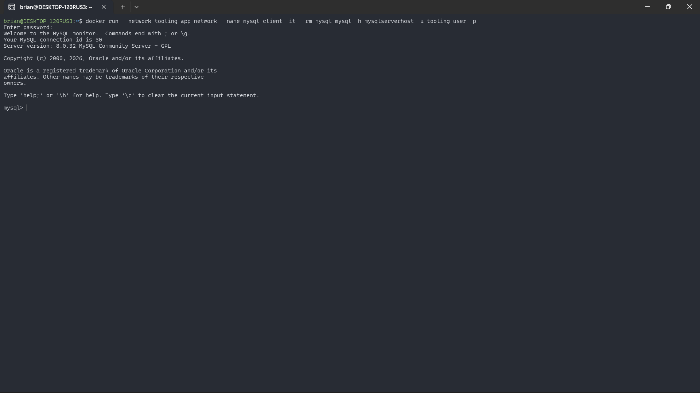
_Figure 1: MySQL container successfully installed and running_

### **Step 2: List Downloaded Images**

```bash
docker images
```

### **Step 3: Deploy MySQL Container**

Run the MySQL container with a root password:

```bash
docker run --name mysql-server -e MYSQL_ROOT_PASSWORD=admin123 -d mysql/mysql-server:latest
```

### **Step 4: Verify Container is Running**

```bash
docker ps -a
```

**Screenshot**: 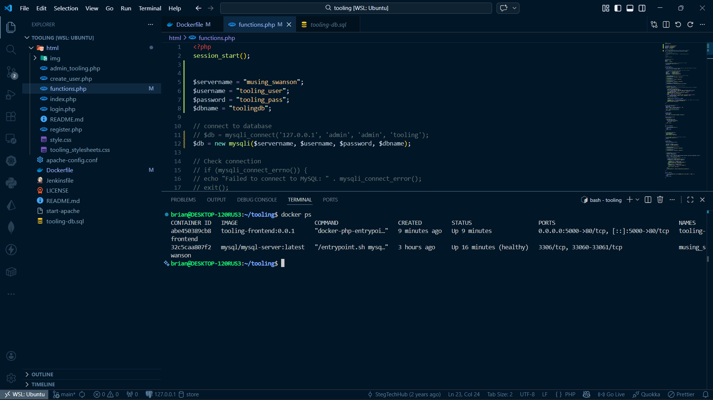
_Figure 2: Docker ps command showing running containers_

Expected output:

```
CONTAINER ID   IMAGE                                COMMAND                  CREATED          STATUS                             PORTS                       NAMES
7141da183562   mysql/mysql-server:latest            "/entrypoint.sh mysq…"   12 seconds ago   Up 11 seconds (health: starting)   3306/tcp, 33060-33061/tcp   mysql-server
```

### **Step 5: Connect to MySQL Container Directly**

```bash
docker exec -it mysql-server mysql -uroot -p
# Enter password: admin123 when prompted
```

### **Step 6: Create a Custom Network**

```bash
docker network create --subnet=172.18.0.0/24 tooling_app_network
docker network ls
```

**Screenshot**: 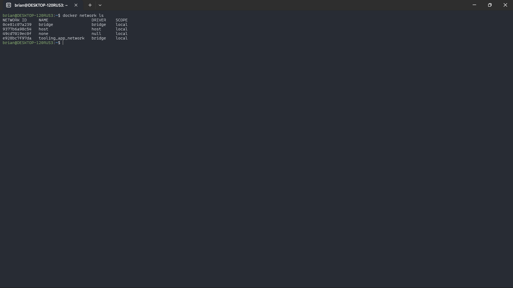
_Figure 3: Creating a custom Docker network for container communication_

### **Step 7: Set Environment Variable for Password**

```bash
export MYSQL_PW=admin123
echo $MYSQL_PW
```

### **Step 8: Create Database User**

Create a file named `create_user.sql`:

```sql
CREATE USER 'tooling_user'@'%' IDENTIFIED BY 'tooling_pass';
GRANT ALL PRIVILEGES ON * . * TO 'tooling_user'@'%';
```

Run the script:

```bash
docker exec -i mysql-server mysql -uroot -p$MYSQL_PW < create_user.sql
```

**Screenshot**: 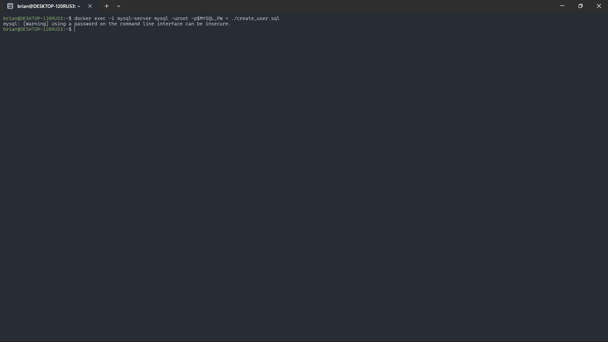
_Figure 4: Executing create_user.sql to create database user_

### **Step 9: Load Database Schema**

Create `tooling-db.sql`:

```sql
CREATE TABLE IF NOT EXISTS users (
    id INT AUTO_INCREMENT PRIMARY KEY,
    username VARCHAR(50) UNIQUE NOT NULL,
    password VARCHAR(255) NOT NULL,
    email VARCHAR(100) UNIQUE NOT NULL,
    created_at TIMESTAMP DEFAULT CURRENT_TIMESTAMP
);

INSERT INTO users (username, password, email) VALUES
('test', '12345', 'test@gmail.com'),
('demo', 'password123', 'demo@example.com');
```

Load the schema:

```bash
docker exec -i mysql-server mysql -uroot -p$MYSQL_PW < tooling-db.sql
```

**Screenshot**: 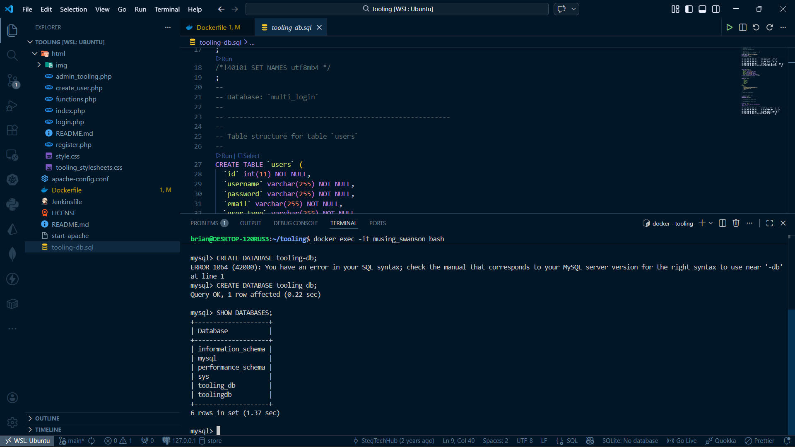
_Figure 5: MySQL tables successfully created_

---

## **Part 2: Containerize Tooling Application**

### **Step 1: Clone Tooling Application Repository**

```bash
git clone https://github.com/Munyat/tooling-2.git tooling-02
cd tooling-02
```

### **Step 2: Build Docker Image**

```bash
docker build -t tooling:0.0.1 .
```

### **Step 3: Run the Tooling Container**

```bash
docker run --network tooling_app_network -p 8085:80 -it tooling:0.0.1
```

### **Step 4: Access the Application**

Open browser: `http://localhost:8085`

**Screenshot**: 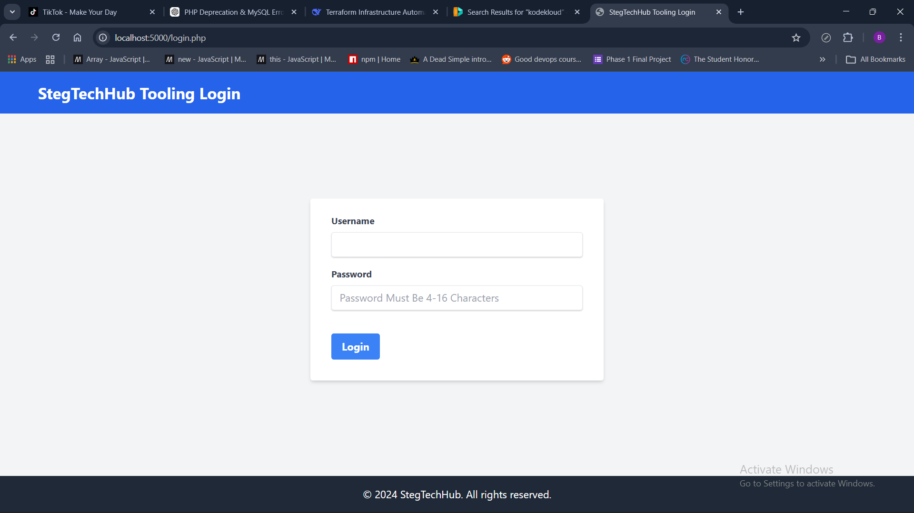
_Figure 6: Tooling application login page at localhost:5000_

Login with:

- Email: `test@gmail.com`
- Password: `12345`

**Screenshot**: 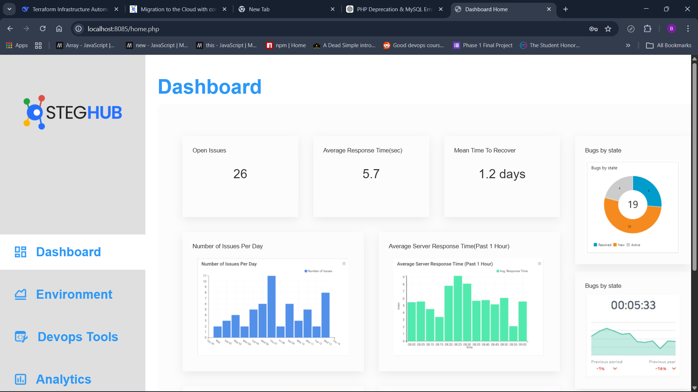
_Figure 7: Tooling application dashboard after successful login_

---

## **Part 3: Docker Compose for Multi-Container Orchestration**

### **Step 1: Create Docker Compose File**

Create `tooling.yaml`:

```yaml
version: "3.9"

services:
  tooling_frontend:
    build: .
    container_name: tooling-app
    ports:
      - "5000:80"
    volumes:
      - tooling_frontend:/var/www/html
    networks:
      - tooling_network
    depends_on:
      db:
        condition: service_healthy
    environment:
      - DB_HOST=db
      - DB_USER=tooling_user
      - DB_PASSWORD=tooling_pass
      - DB_NAME=toolingdb
    restart: always

  db:
    image: mysql:5.7
    container_name: tooling-db
    restart: always
    environment:
      MYSQL_DATABASE: toolingdb
      MYSQL_USER: tooling_user
      MYSQL_PASSWORD: tooling_pass
      MYSQL_ROOT_PASSWORD: rootpassword
    volumes:
      - db_data:/var/lib/mysql
      - ./tooling-db.sql:/docker-entrypoint-initdb.d/schema.sql
    networks:
      - tooling_network
    healthcheck:
      test: ["CMD", "mysqladmin", "ping", "-h", "localhost"]
      interval: 10s
      timeout: 5s
      retries: 5

volumes:
  tooling_frontend:
  db_data:

networks:
  tooling_network:
    driver: bridge
```

### **Step 2: Start with Docker Compose**

```bash
docker-compose -f tooling.yaml up -d
docker-compose -f tooling.yaml ps
```

**Screenshot**: 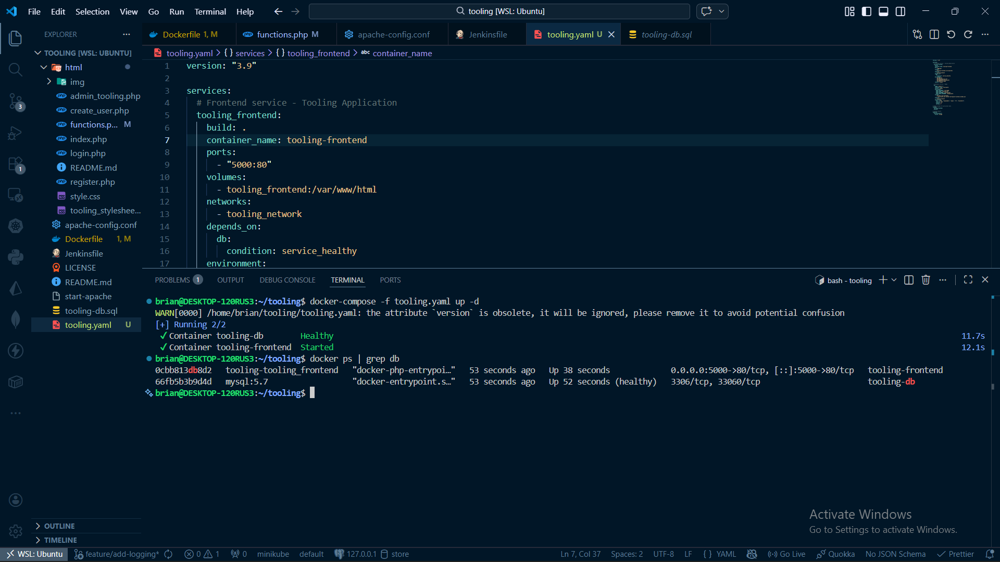
_Figure 8: Docker Compose showing all containers running_

Access the app: `http://localhost:5000`

---

## **Practice Task 1: Push Images to Docker Hub**

### **Step 1: Login to Docker Hub**

```bash
docker login
```

**Screenshot**: 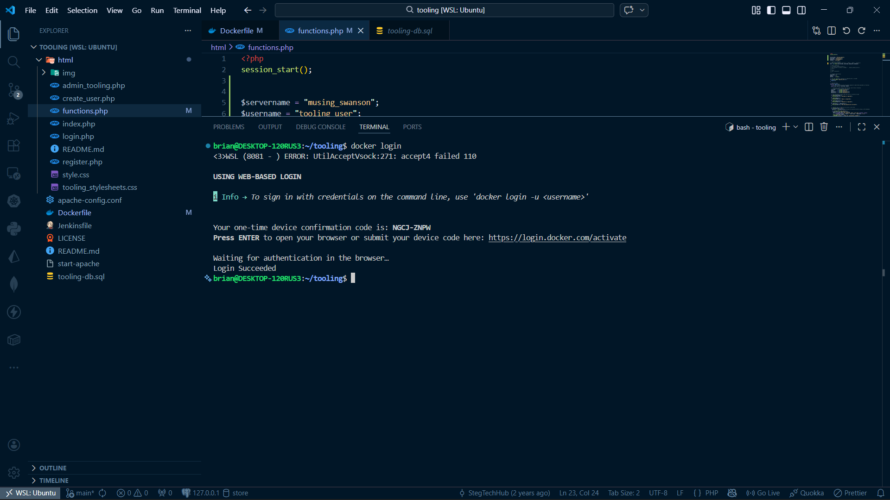
_Figure 9: Docker Hub login successful_

### **Step 2: Create Docker Hub Repository**

**Screenshot**: 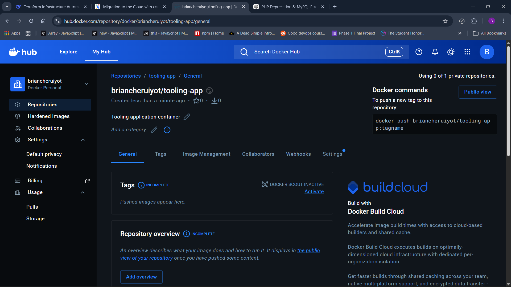
_Figure 10: Docker Hub repository created_

**Screenshot**: 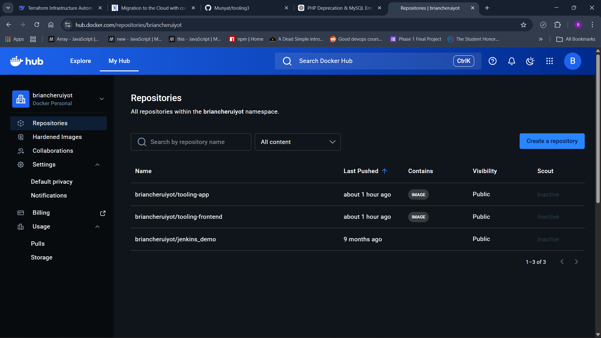
_Figure 11: All repositories in Docker Hub dashboard_

### **Step 3: Tag and Push Images**

```bash
docker tag tooling:0.0.1 yourusername/tooling-frontend:0.0.1
docker push yourusername/tooling-frontend:0.0.1
```

**Screenshot**: 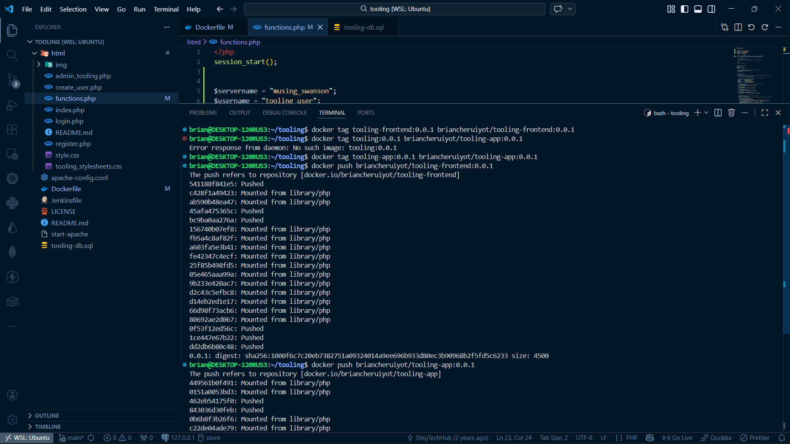
_Figure 12: Docker image tagging for later push_

**Screenshot**: 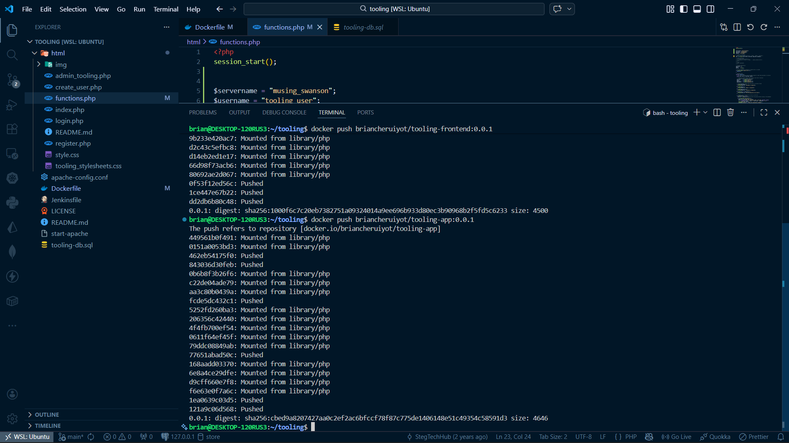
_Figure 13: Docker images successfully pushed_

**Screenshot**: 
_Figure 14: Docker Hub showing updated image version_

---

## **Practice Task 2: CI/CD Pipeline with Jenkins**

### **Step 1: Create Feature Branch**

```bash
git checkout -b feature/add-logging
git push origin feature/add-logging
```

**Screenshot**: 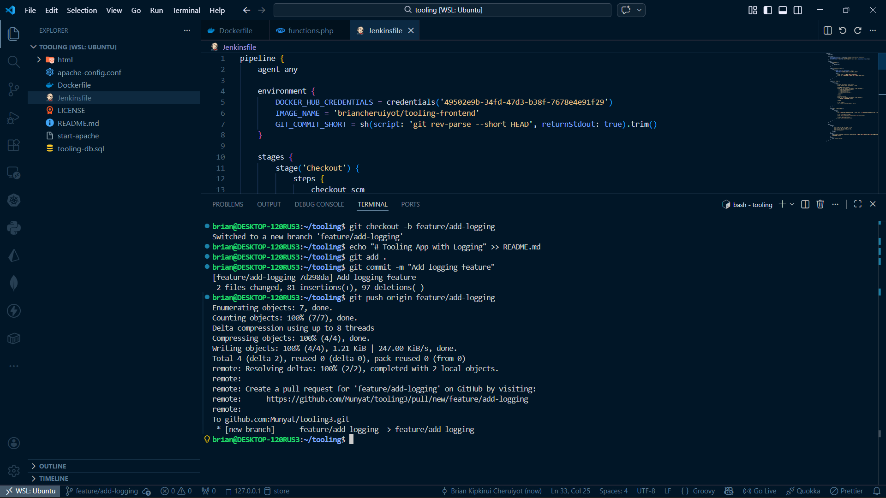
_Figure 15: Creating a feature branch in Git_

### **Step 2: Jenkins Multi-Branch Pipeline**

**Screenshot**: 
_Figure 16: Jenkins Blue Ocean showing different branches (main and feature)_

### **Step 3: Feature Branch Build Success**

**Screenshot**: 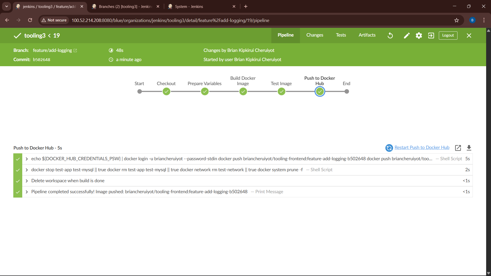
_Figure 17: Feature branch multi-build successful in Jenkins_

### **Step 4: Main Branch Build Success**

**Screenshot**: 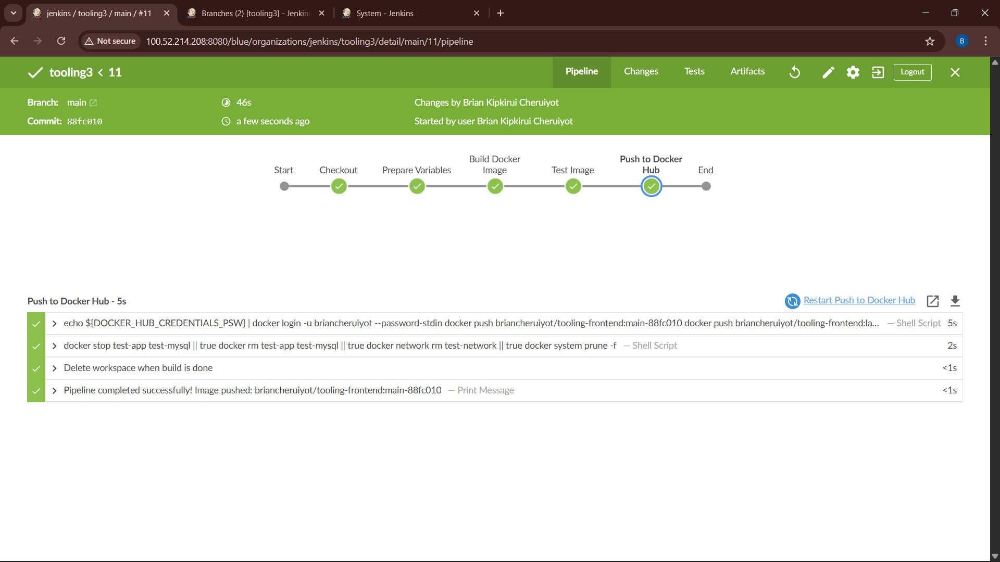
_Figure 18: Main branch multi-build successful in Jenkins_

### **Step 5: Docker Hub Images from Jenkins**

**Screenshot**: 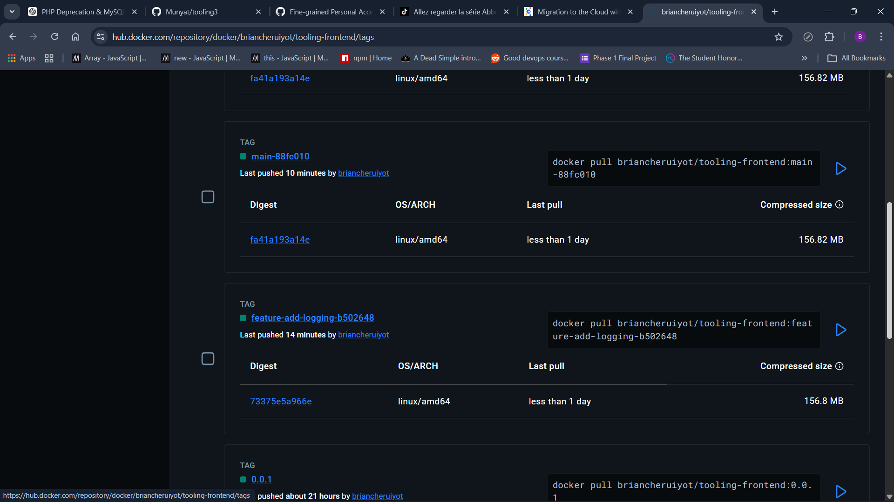
_Figure 19: Docker Hub showing images pushed from Jenkins CI pipeline_

---

## **📸 Complete Screenshot Reference**

| #   | Screenshot Name                                                 | Description                                        | Figure    |
| --- | --------------------------------------------------------------- | -------------------------------------------------- | --------- |
| 1   | mysql_container_intsalled_and_working.png                       | MySQL container successfully installed and running | Figure 1  |
| 2   | docker_ps_command_showing_containers.png                        | Docker ps showing running containers               | Figure 2  |
| 3   | docker_network_command.png                                      | Creating custom Docker network                     | Figure 3  |
| 4   | docker_mysql_executing_create_user.sql.png                      | Executing create_user.sql                          | Figure 4  |
| 5   | mysql_created_tables.png                                        | MySQL tables successfully created                  | Figure 5  |
| 6   | localHoast_5000_login_page.png                                  | Tooling app login page                             | Figure 6  |
| 7   | toolong_dashboard.png                                           | Tooling app dashboard                              | Figure 7  |
| 8   | docker_compose_ps_all_containers_running.png                    | Docker Compose containers running                  | Figure 8  |
| 9   | docker_login.png                                                | Docker Hub login                                   | Figure 9  |
| 10  | docker_repo_created.png                                         | Docker Hub repository created                      | Figure 10 |
| 11  | all_repositories_dockerhub_dashoard.png                         | All repositories dashboard                         | Figure 11 |
| 12  | docker_image_tagging_for_later_push.png                         | Tagging images for push                            | Figure 12 |
| 13  | docker_pushed_images.png                                        | Images successfully pushed                         | Figure 13 |
| 14  | after_pushing_image_dockerhub_image_showing updated_version.png | Updated image version                              | Figure 14 |
| 15  | creating_git_feature_branch_practice1.png                       | Creating feature branch                            | Figure 15 |
| 16  | jenkins_blue_ocean_showing diffrent_branches_main_feature.png   | Jenkins Blue Ocean branches                        | Figure 16 |
| 17  | feature_branch_jenkins_multibuild_success.png                   | Feature branch build success                       | Figure 17 |
| 18  | jenkins_main_multibuild_success.png                             | Main branch build success                          | Figure 18 |
| 19  | docker_hub_showing_images_pushed_from_jenkins.png               | Docker Hub images from Jenkins                     | Figure 19 |

---

## **Repository References**

| File         | Repository | Link                                                              |
| ------------ | ---------- | ----------------------------------------------------------------- |
| Dockerfile   | tooling-2  | [View](https://github.com/Munyat/tooling-2/blob/main/Dockerfile)  |
| Jenkinsfile  | tooling-2  | [View](https://github.com/Munyat/tooling-2/blob/main/Jenkinsfile) |
| html/        | tooling-2  | [View](https://github.com/Munyat/tooling-2/tree/main/html)        |
| Dockerfile   | tooling3   | [View](https://github.com/Munyat/tooling3/blob/main/Dockerfile)   |
| Jenkinsfile  | tooling3   | [View](https://github.com/Munyat/tooling3/blob/main/Jenkinsfile)  |
| tooling.yaml | tooling3   | [View](https://github.com/Munyat/tooling3/blob/main/tooling.yaml) |
